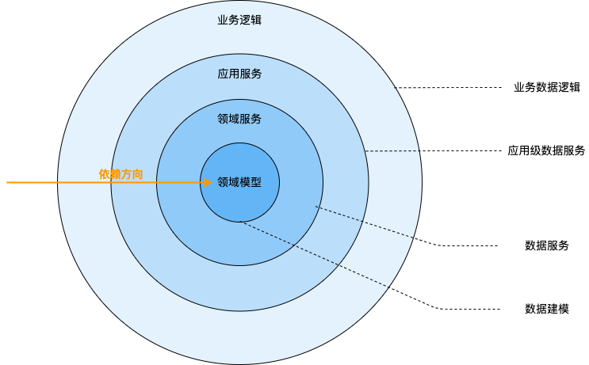

# 架构设计

基于[《Clean Architecture on Frontend》](https://dev.to/bespoyasov/clean-architecture-on-frontend-4311)以及 DDD（Domain-Driven Design，领域驱动设计）相关思想，本项目做了以下分层设计：

通过数据建模建立领域模型，基于领域模型构建领域服务，应用服务和业务逻辑则属于应用层，依赖领域服务和领域模型。

该架构模型规定：只有外层可以依赖内层。这意味着：
- 领域必须独立；
- 应用层可以依赖领域；
- 最外层可以依赖任何东西；

不控制依赖方向的代码可能会变得非常复杂和难以维护。比如：
- 循环依赖，模块 A 依赖于 B，B 依赖于 C，C 依赖于 A；
- 可测试性差，即使测试一小块功能也不得不模拟整个系统；
- 耦合度太高，因此模块之间的交互会很脆弱；

:::note 备注
**为什么采用 DDD 的架构设计？**

DDD 本质上可以认为是一种降低软件复杂度的手段，其推荐的方法论能够较好统一业务复杂度和技术复杂度，规范基础编程范式。基于 DDD 设计的分层架构在可维护性和可扩展性上都更具优势。具体可详读[《Clean Architecture on Frontend》](https://dev.to/bespoyasov/clean-architecture-on-frontend-4311)。
:::